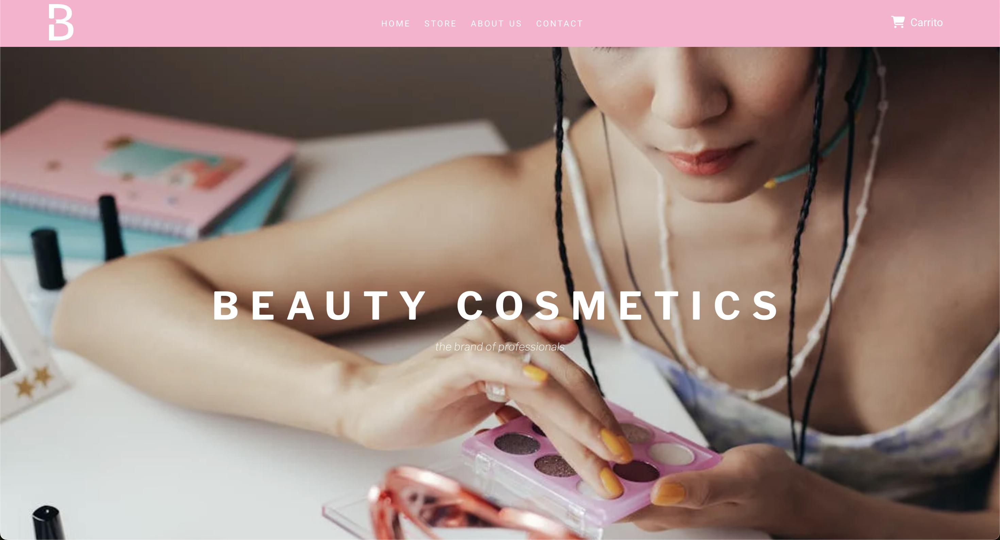
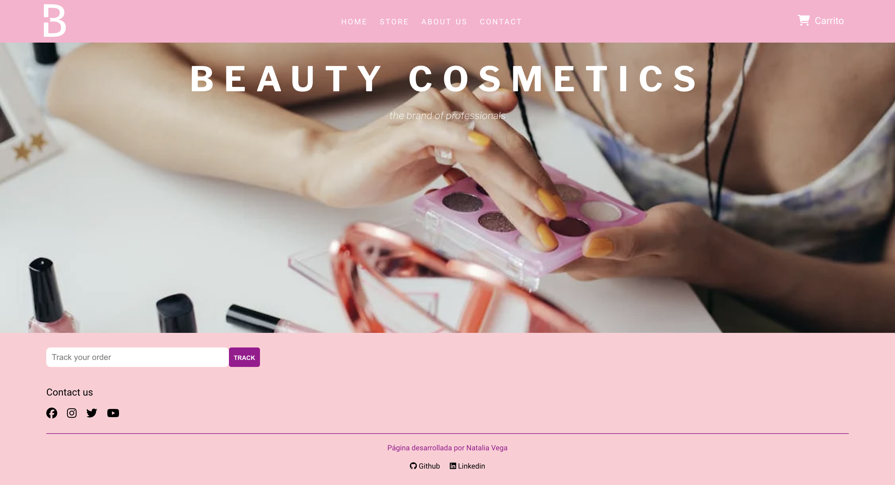
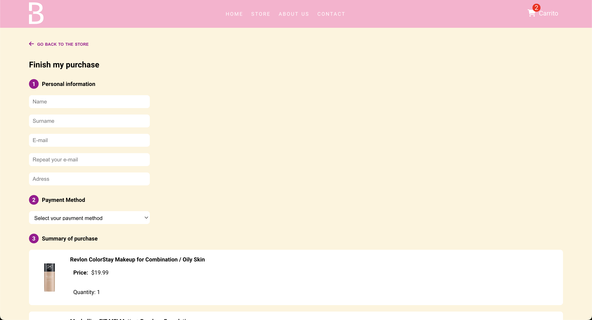
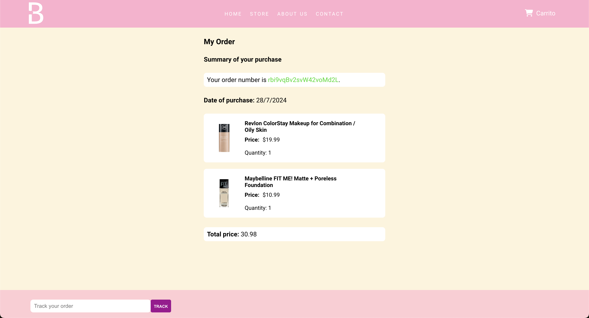

## Beauty Cosmetics E-commerce
- ⁠*Last update:* 17 de febrero de 2023
- ⁠*Link del proyecto:* [Beauty Cosmetics](https://beautycosmetics.vercel.app/)

> Nota: Resubida del proyecto original debido a perdida [github](https://github.com/nataliavega98/Beauty-Cosmetics)

### Descripcion
En este proyecto decidí realizar un e-commerce sobre productos de cosmética desarrollado con la libreria de React JS. En cuanto al estilado de la página lo realicé completamente con CSS puro. 

### Tecnologías
- ⁠*React JS*
- ⁠*React Router*
- ⁠*Firebase*
- ⁠*CSS*

### Instalación
Para instalar el proyecto en tu computadora, debes seguir los siguientes pasos:
1.⁠ ⁠Clonar el repositorio

``
git clone
 ⁠``

2.⁠ ⁠Instalar las dependencias

``
npm install
 ``

3.⁠ ⁠Correr el proyecto

``
npm start
 ⁠``

### Navegabilidad
La navegabilidad dentro de la página esta hecha con React Router donde tenemos para navegar hacia:
    📍El Home "/".
    📍El sector de about us "/aboutUs".
    📍El sector de contacto "/contact".
    📍La tienda "/store".
    📍El detalle del producto "/store/product/:productId"
    📍El formulario de pago "/payment"
    📍El detalle o resumen de la compra una vez realizado el pago "/order/:orderId".

### Funcionalidades
- ⁠*Registro de usuario*
- ⁠*Inicio de sesión*
- ⁠*Carrito de compras*
- ⁠*Formulario de pago*
- ⁠*Detalle de la compra*
- ⁠*Filtrado de productos por categoría*
- ⁠*Ordenamiento de productos por precio*
- ⁠*Buscador de productos*
- ⁠*Detalle de producto*
- ⁠*Añadir y quitar productos del carrito*
- ⁠*Cantidad de productos en el carrito*
- ⁠*Cálculo del total de la compra*
- ⁠*Validación de campos en el formulario de pago*
- ⁠*Envío de email de confirmación de compra*

### Capturas - 17 de febrero de 2023

